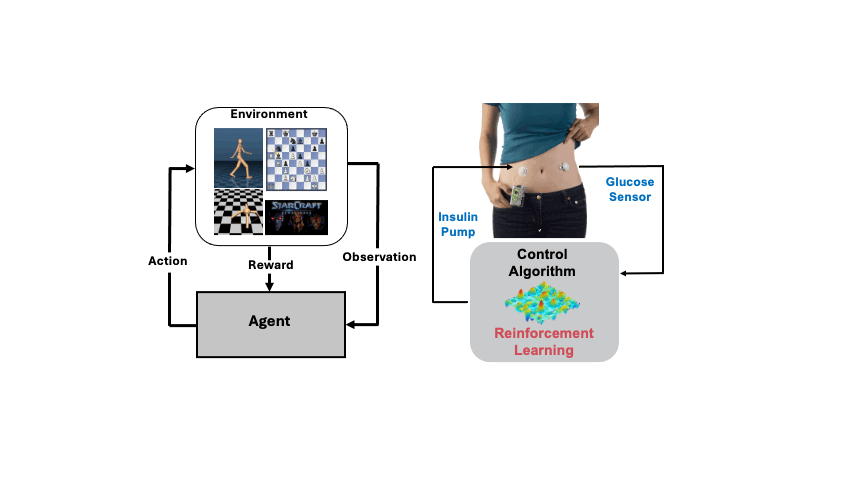

# Reinforcement Learning for Heath 

<!---
We explore the use of RL in healthcare applications.
Reinforcement Learning (RL) is a Machine Learning (ML) paradigm, used for decision-making tasks, where an agent learns to achieve a specified goal, by interacting with its underlying environment. Compared to the widely explored games and physics 
simulation problems in RL, real-world RL systems must contend with much more [technical challenges](https://github.com/google-research/realworldrl_suite).
--->

